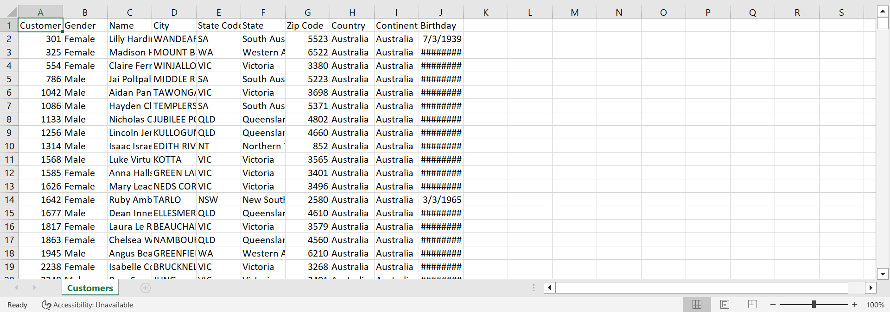
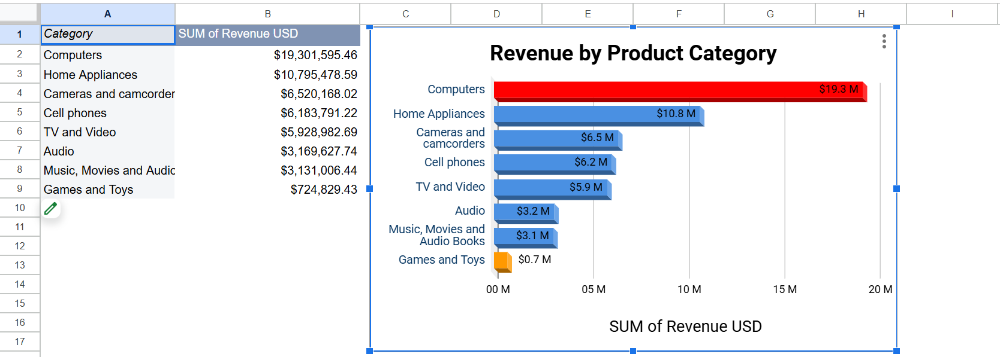
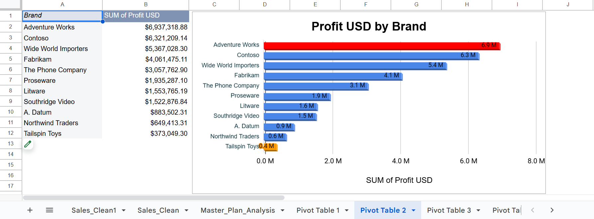
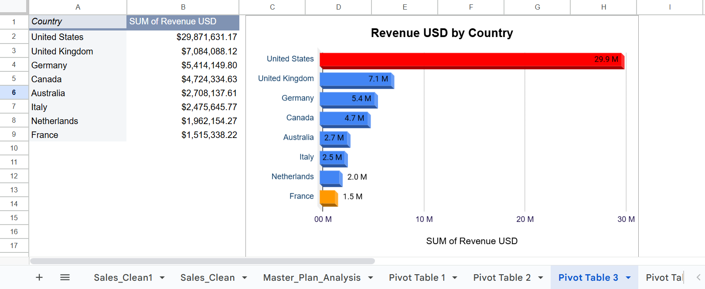
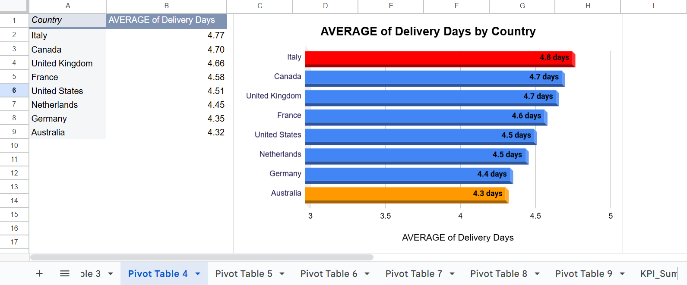
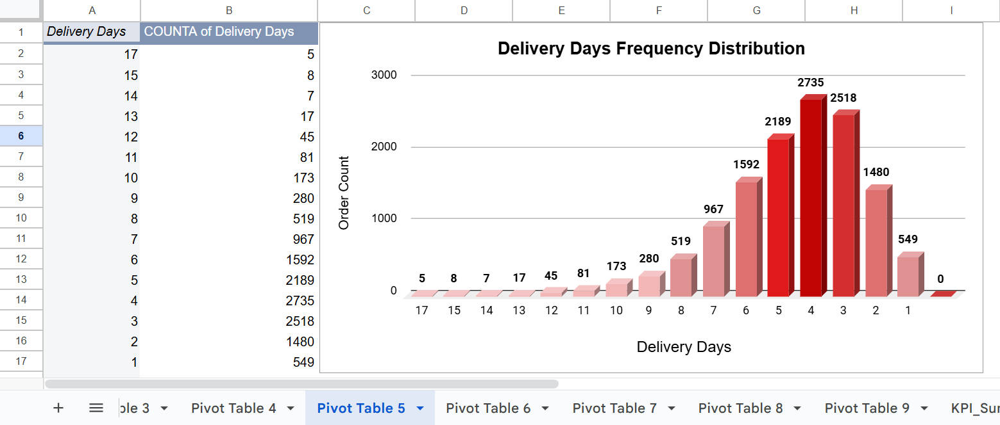
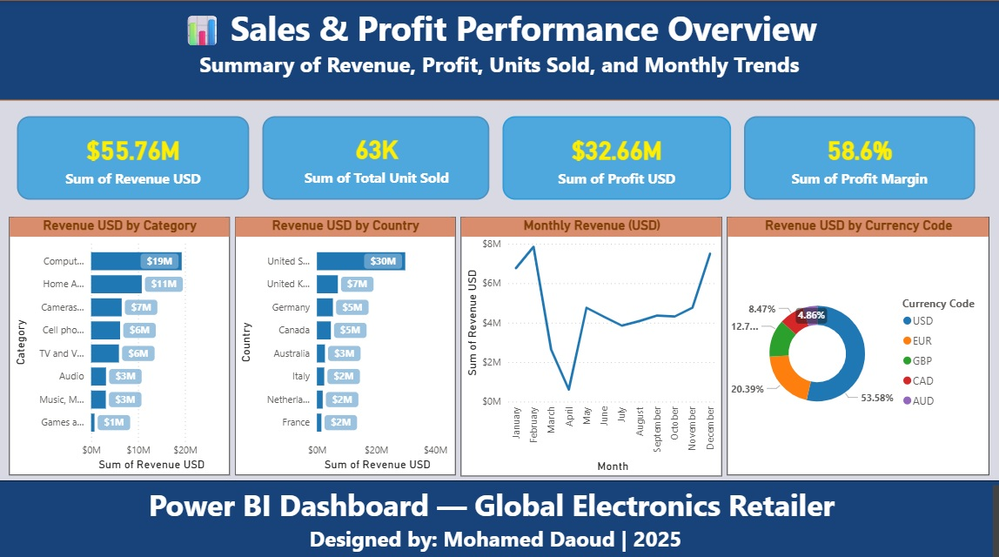

# Global Electronics Retailer – Sales & Profit Analysis

## 1. Project Overview
This project analyzes sales performance for a **global electronics retailer** using real-world style data.

The goal is to:
- Understand **Revenue, Profit, Units Sold, and Profit Margin**
- Compare performance by **Product Category** and **Country**
- Explore **Monthly Revenue trends** across the year
- Build a clean, modern **Power BI dashboard** and a full analysis report

This project is part of my data analytics portfolio.

---

## 2. Tools Used
- **Google Sheets** – Data cleaning, transformation, pivot tables, charts  
- **Microsoft Excel** – Working with the original dataset  
- **Power BI** – Data modelling, DAX measures, interactive dashboard  
- **Microsoft Word + PDF** – Final analysis report & documentation  

---

## 3. Folder Structure (What you will find here)

### 📁 1) Data Files (Before/After) Cleaning
Raw and prepared data files:
- `Customers.csv`
- `Products.csv`
- `Sales.csv`
- `Stores.csv`
- `Exchange_Rates.csv`
- `Data_Dictionary.csv`
- `Global+Electronics+Retailer_Sales.xlsx` (main working file)

### 📁 2) Documentation (Word + PDF)
Full written report of the project:
- `Global_Electronics_Retailer_Data_Analysis_Project.docx`
- `Global_Electronics_Retailer_Data_Analysis_Project_PDF.pdf`

This document explains:
- Business questions
- Data cleaning steps
- Exploratory analysis
- Key findings & recommendations

### 📁 3) Power BI Dashboard (.pbix)
Interactive dashboard files:
- `Power BI Dashboard_Sales, Revenue.pbix`
- `Dashboard.jpg` – main screenshot of the Power BI report

### 📁 4) Dashboard Screenshots
Additional visuals used in the project and portfolio:
- `Dashboard.jpg`
- `Monthly Revenue Trend.jpg`
- `Monthly Profit Trend.jpg`
- `Profits by Brand.jpg`
- `Revenue by Product Category.jpg`
- `Delivery Days Frequency Distribution.jpg`
- `Revenue vs. Profit Monthly Performance.jpg`

### 📁 5) Screenshots Before / After (Insights)
**Before:**  
- Screenshots of raw tables: `Customers_Before.png`, `Sales_Before.png`, `Products_Before.png`, `Stores_Before.png`, `Exchange_Rate_Before.png`

**After:**  
- Final pivot charts & visuals from Google Sheets: `Pivot_Chart_1.png` … `Pivot_Chart_9.png`

These folders show the transformation **from messy data → clean insights**.

### 📁 6) Final Exports (PDF, Images, Case Study)
- `Global_Electronics_Retailer_Data_Analysis_Project_PDF.pdf` – final report
- `Dashboard.jpg` – final dashboard image
- `Case Study.pdf` – 2-page case study summary
- `LinkedIn Post.txt` – caption used for my LinkedIn portfolio post

---

## 4. Workflow Summary (How I worked on this project)

1. **Understanding the business goal**
   - Analyze sales & profit performance for a global electronics retailer.
   - Identify top categories, top countries, and monthly trends.

2. **Data Cleaning & Preparation (Google Sheets / Excel)**
   - Removed duplicates and fixed inconsistent formats
   - Checked missing values, corrected data types
   - Joined sales data with products, customers, and stores
   - Added calculated fields where needed

3. **Exploratory Data Analysis**
   - Built pivot tables and charts for:
     - Revenue by Category
     - Revenue by Country
     - Monthly Revenue & Profit trends
     - Profitability by brand and segment

4. **Reporting & Documentation**
   - Wrote a structured analysis report (Word + PDF)
   - Documented assumptions, steps, and insights

5. **Power BI Dashboard**
   - Imported the cleaned dataset
   - Created measures for:
     - Total Revenue, Total Profit, Units Sold, Profit Margin
   - Designed KPI cards, bar charts, line charts, and a donut chart
   - Applied a custom theme & layout for a modern dashboard

6. **Portfolio Packaging**
   - Exported final PDFs and images
   - Created a 2-page case study
   - Organized all files into this portfolio folder
## 5. Key Insights (Short Version)

- **Total Revenue:** \$55.76M  
- **Total Profit:** \$32.66M  
- **Units Sold:** 63K  
- **Profit Margin:** 58.6%  

- **Top Country:** United States (~\$30M revenue)  
- **Top Categories:** Computers and Home Appliances  
- **Trend:** Strong seasonal drop around April, with recovery in later months  
- **Currency:** USD represents more than half of total revenue share  

---

## 6. How to View the Dashboard

1. Download `Power BI Dashboard_Sales, Revenue.pbix`
2. Open it using **Microsoft Power BI Desktop**
3. Interact with:
   - KPI cards at the top
   - Category & country bar charts
   - Monthly revenue line chart
   - Revenue by currency donut chart

---

## 7. Useful Links

- **Google Drive Project Folder:**  
https://drive.google.com/drive/folders/1H4f283O9O9_xZtd5teGFjCPMp863Gri_?usp=drive_link

- **LinkedIn Post for this Project:**  
 https://www.linkedin.com/posts/mohamed-daoud-22s_powerbi-dataanalytics-businessintelligence-activity-7397276246654681088-QdEm?utm_source=share&utm_medium=member_desktop&rcm=ACoAAFEgXNcBt-NH88tvwwL-GBeaq9QyHJXk7-w

## 8. About Me

**Mohamed Daoud** – Aspiring Data Analyst  
Interested in: Data Analytics, Business Intelligence, and Dashboard Design.

If you have any feedback or opportunities, feel free to reach out via LinkedIn.

## 📊 Before & After – Data Cleaning Evidence

Below are screenshots showing the data before and after cleaning:

### Before Cleaning

### After Cleaning (Pivot & Analysis)

  
  
  
  
  
  
  
  
  

---

## 📊 Final Dashboard Preview

Below is a preview of the final interactive dashboard created after the full cleaning & analysis:

---

## 🔗 Project Files (Google Drive)
All project files (Google Sheets, Power BI, PDFs, and resources) are available here:

👉 **Google Drive Folder:**  
https://drive.google.com/your-link-here

